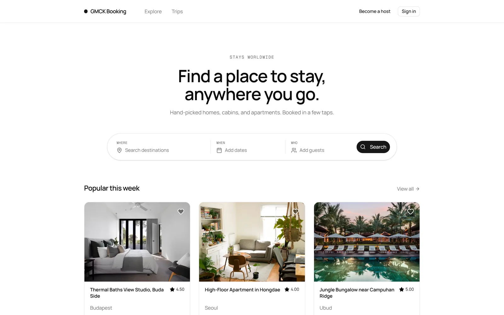
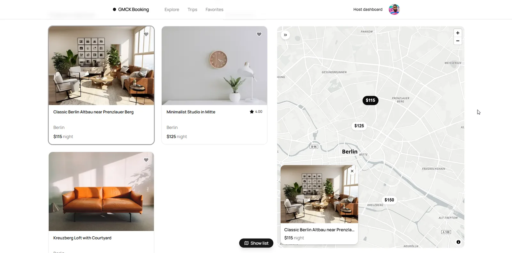

<p align="center">
  
</p>

<h1 align="center">booking-service</h1>

<p align="center">
  <strong>Property rental platform.</strong>
</p>

<p align="center">
  <a href="https://github.com/gmcky/booking-service/stargazers"></a>
  <a href="https://github.com/gmcky/booking-service/commits/main"></a>
  
  
</p>

<p align="center">
  <a href="#live-demo">Live demo</a> •
  <a href="#design-decisions">Design decisions</a> •
  <a href="#tech-stack">Stack</a> •
  <a href="#getting-started">Quick start</a> •
  <a href="#project-structure">Structure</a> •
  <a href="#api-documentation--testing">API docs</a> •
  <a href="#testing">Testing</a> •
  <a href="#cicd">CI/CD</a>
</p>

---

Full-stack property rental platform built as a portfolio project. The backend covers property listings, bookings with overlap prevention, Stripe payments with webhook idempotency, JWT rotation with reuse detection, email verification with real delivery, Google sign-in, and async email/image processing via BullMQ workers. The frontend is a Next.js app with map-driven search, a full booking and checkout flow, host tools, and a mobile layout. Everything runs in Docker.



| Map-driven browse | Property page |
|---|---|
|  |  |

<p align="center">
  
</p>

## Live demo

- **Web app:** https://booking.gmcky.dev
- **API base:** https://booking-api.gmcky.dev/api/v1
- **Interactive docs (Swagger):** https://booking-api.gmcky.dev/api-docs
- **Health check:** https://booking-api.gmcky.dev/health

### Demo credentials

| Role | Email | Password | Notes |
|------|-------|----------|-------|
| USER | `demo@booking.dev` | `demo1234` | Empty account. Create your own properties and bookings here, or sign in with Google to get a fresh one. |

The database is seeded with 80+ properties across 38 cities, 40+ hosts, ~200 bookings in every status, and hand-written reviews with category ratings. Only the demo user above is public; seeded host/admin accounts use private passwords.

### Try it

The web app is the quickest tour: browse, open the map, book a stay, pay with Stripe test card `4242 4242 4242 4242` (any future date, any CVC).

For the API directly, everything below happens inside Swagger UI, no terminal required.

1. Open the [interactive docs](https://booking-api.gmcky.dev/api-docs).
2. Expand `POST /auth/login`. The demo credentials are pre-filled. Click **Try it out → Execute** and copy the `accessToken` from the response.
3. Click the **Authorize** button at the top of the page, paste the token, then close the dialog. Every protected endpoint is now unlocked.
4. From there: browse properties, create a booking, leave a review, etc. Public endpoints like `GET /properties` work without logging in.

## Design decisions

- **Double-booking prevention.** Serializable transaction isolation on booking creation ensures concurrent requests for the same dates resolve correctly, with automatic retry on serialization conflicts.
- **Optimistic inventory holds.** Only paid (confirmed) bookings block dates: an unpaid booking holds nothing, so abandoned checkouts and booking bots cannot lock a listing. Overlapping unpaid bookings race to payment; the winner is confirmed inside a serializable transaction, the loser's card authorization is voided (never charged, no processing fee). Unpaid bookings expire at check-in or after 24 hours, whichever comes first, and can be resumed from the trips page until then.
- **Authorize-then-capture payments.** Cards are authorized at checkout and captured only when the booking wins its confirm race. Stale-amount authorizations (booking repriced mid-flight) are voided by the webhook rather than captured. A refund-velocity limit blocks accounts that cycle book-pay-cancel through the free-cancellation window.
- **JWT rotation with reuse detection.** Refresh tokens are hashed and tracked by jti. Reuse of a token (e.g. from a stolen session) triggers full session invalidation for that user.
- **Stripe payment flow.** PaymentIntent lifecycle with server-side amounts, webhook signature verification, and idempotent event processing via a processed-events table.
- **Email verification as an abuse gate.** Real delivery via Resend. Unverified accounts can browse and search but cannot book, host, or review: every platform email is potential spam to someone else's address until that address is proven.
- **Google sign-in without a session library.** The GIS ID token is verified against Google's JWKS (issuer, audience, RS256). Accounts link by verified email; linking to an unverified password account scrubs the password and revokes sessions to close the pre-registration hijack vector. Token custody stays in-house because rotation and reuse detection are the point.
- **Host cancellations via admin approval.** A host cannot silently drop a confirmed guest. Cancellation requests go through review (configurable auto-approval window) and the guest always gets a full refund.
- **Cache invalidation without key scans.** Cached queries embed a namespace version; invalidation is a single Redis INCR, safe under any number of instances.
- **Background workers.** Email, image processing, payouts, and cleanup run as separate BullMQ processes with retry and exponential backoff.
- **Brute-force protection.** Failed login attempts tracked in Redis, account locks after 5 failures for 15 minutes. Login timing is equalized against a dummy bcrypt hash so unknown emails cannot be enumerated by response time.
- **Typed API contract.** OpenAPI annotations on every route generate the client's TypeScript types; a contract drift is a compile error on the frontend, not a runtime surprise.
- **Error monitoring.** Sentry captures unhandled exceptions and 5xx responses in production with full stack traces and request context.

## Tech stack

### Backend

| Layer | Tech |
|-------|------|
| Runtime | Node.js 22, TypeScript 5.9 (strict, ESM) |
| Framework | Express 5 |
| Database | PostgreSQL 16, Prisma 7 |
| Cache & Queues | Redis 7, BullMQ |
| Auth | JWT via jose, bcrypt, Google OIDC |
| Payments | Stripe (PaymentIntent + webhooks) |
| Validation | Zod 4 |
| Images | Sharp (resize, webp conversion) |
| Storage | AWS S3 |
| Email | Nodemailer via BullMQ worker, Resend in production |
| Logging | Pino (structured JSON) |
| Monitoring | Sentry (errors + performance) |
| Testing | Vitest, Testcontainers, Supertest |
| Infra | Docker, Docker Compose (dev + prod) |

### Frontend

| Layer | Tech |
|-------|------|
| Framework | Next.js 16 (App Router), TypeScript strict |
| UI | Tailwind CSS 4, shadcn/ui on base-ui primitives, motion |
| Server state | TanStack Query 5 |
| Client state | Zustand (auth only, in-memory) |
| Forms | react-hook-form + Zod |
| API client | openapi-fetch with types generated from the backend OpenAPI spec |
| Maps | MapLibre GL, OpenFreeMap tiles, Nominatim/Photon geocoding |
| Testing | Vitest, Testing Library, Playwright |

## Getting started

Prerequisites: Node.js 22+, pnpm, Docker.

**Backend:**

```bash
git clone https://github.com/gmcky/booking-service
cd booking-service/server

cp .env.example .env   # fill in secrets

pnpm install
pnpm infra:up          # starts Postgres + Redis in Docker
pnpm db:migrate        # applies migrations
pnpm db:seed           # optional test data
pnpm dev               # http://localhost:3000
```

Workers run as separate processes:

```bash
pnpm workers
```

**Full Docker** (app + infra):
```bash
pnpm docker:dev
```

**Frontend:**

```bash
cd booking-service/client

pnpm install
pnpm dev               # http://localhost:3001, expects the API on :3000
```

API types are committed, so the client builds without a live backend. After changing the API contract, regenerate them with `pnpm gen:api` (needs the backend running).

## Project structure

```
booking-service/
├── server/
│   ├── src/
│   │   ├── config/            # env validation (Zod), Swagger spec
│   │   ├── modules/           # feature modules, each with controller/service/routes/validators
│   │   │   ├── auth/          # register, login, refresh, Google sign-in, email verification, password reset
│   │   │   ├── users/         # profiles, avatars, password change, soft delete
│   │   │   ├── properties/    # CRUD, search filters, map markers, image pipeline
│   │   │   ├── bookings/      # availability, reservations, date management, host cancellations
│   │   │   ├── payments/      # Stripe integration, webhooks, refunds, payouts
│   │   │   ├── reviews/       # ratings with categories, host replies, moderation
│   │   │   ├── favorites/     # wishlists
│   │   │   └── admin/         # host cancellation review, platform settings
│   │   ├── shared/
│   │   │   ├── lib/           # prisma, redis, stripe, logger clients
│   │   │   ├── middlewares/   # auth, validation, error handling
│   │   │   ├── queues/        # BullMQ queue definitions
│   │   │   └── utils/         # date helpers, pagination
│   │   ├── tests/             # unit + integration (Testcontainers)
│   │   └── workers/           # BullMQ workers (email, image, cleanup, payout, geocode)
│   ├── prisma/
│   │   ├── schema.prisma      # 12 models
│   │   └── migrations/
│   ├── bruno/                 # API test collection
│   └── docker-compose*.yml    # infra / dev / prod configs
└── client/
    └── src/
        ├── app/               # App Router pages: browse, property, checkout, trips, host area, profile
        ├── components/        # ui primitives, search pill, map panel, booking card, forms
        ├── lib/
        │   ├── api/           # generated types, openapi-fetch client with 401 refresh middleware
        │   ├── auth/          # Zustand store, session hook
        │   └── query/         # QueryClient, query key factory
        └── tests/             # unit, component, e2e
```

## API overview

All endpoints under `/api/v1`. Auth via Bearer token (access) + HttpOnly cookie (refresh).

**Auth**: register, login, logout, refresh (with rotation), Google sign-in, email verification, password reset

**Properties**: list with filters (city, dates, guests, amenities, price range), map markers, CRUD, image upload

**Bookings**: create (with availability check), reschedule, cancel with refund policy, early checkout, blocked dates, host cancellation requests

**Payments**: Stripe PaymentIntent, webhook processing, refund flow, host payouts

**Reviews**: create (only after completed booking), category ratings, host replies, reporting

**Favorites**: wishlist add/remove/list

**Users**: profile, avatar upload, password change, account deletion

**Admin**: host cancellation approve/reject, platform settings

## API documentation & testing

**Swagger UI**: available at `/api-docs` when the server is running. Good for a quick look at schemas and endpoint signatures.

**Bruno collection**: located in `server/bruno/`. The better option for testing actual flows: auth, booking lifecycle, Stripe webhooks. Install [Bruno](https://www.usebruno.com/), open the folder, use the `Local` environment, and run requests in sequence (e.g. Login → Create Property → Book → Pay).

## Testing

```bash
# server
pnpm test              # all tests
pnpm test:unit         # unit only (~275 tests)
pnpm test:integration  # uses Testcontainers (needs Docker running)
pnpm test:coverage     # with coverage report

# client
pnpm test              # unit + component (~157 tests)
pnpm test:e2e          # Playwright smoke (needs both servers running)
```

Unit tests cover booking logic, payment helpers, refund policy, auth lockout, Google sign-in. Integration tests use real Postgres via Testcontainers, no mocked database for integration scenarios.

## CI/CD

Every push runs typecheck, lint, and unit tests on GitHub Actions. Branches get the checks, `main` gets the full pipeline.

On merge to `main`: the Docker image is built and pushed to GHCR, then the VPS pulls it, applies migrations, and restarts the containers over SSH. No manual deploys, under 2 minutes from merge to live. The frontend deploys to Vercel on the same push.

```
push → Tests & Checks → Build & Push (GHCR) → Deploy (VPS)
```

Workers and the API server run as separate containers from the same image. SSH keys, GHCR credentials, and the VPS address are stored as GitHub Actions secrets. VPS runs on Hetzner.

## Environment

Copy `.env.example` to `.env`. Key variables:

- `DATABASE_URL`: Postgres connection string
- `REDIS_HOST`, `REDIS_PORT`: Redis for cache, queues, rate limiting
- `JWT_ACCESS_SECRET`, `JWT_REFRESH_SECRET`: signing keys
- `GOOGLE_CLIENT_ID`: Google sign-in (OIDC audience check)
- `STRIPE_SECRET_KEY`, `STRIPE_WEBHOOK_SECRET`: Stripe API
- `SMTP_*`: email sending
- `S3_BUCKET`, `AWS_REGION`: image storage

Client env lives in `client/.env.local`: `NEXT_PUBLIC_API_URL`, `NEXT_PUBLIC_STRIPE_PUBLISHABLE_KEY`, `NEXT_PUBLIC_GOOGLE_CLIENT_ID`.

## License

MIT
